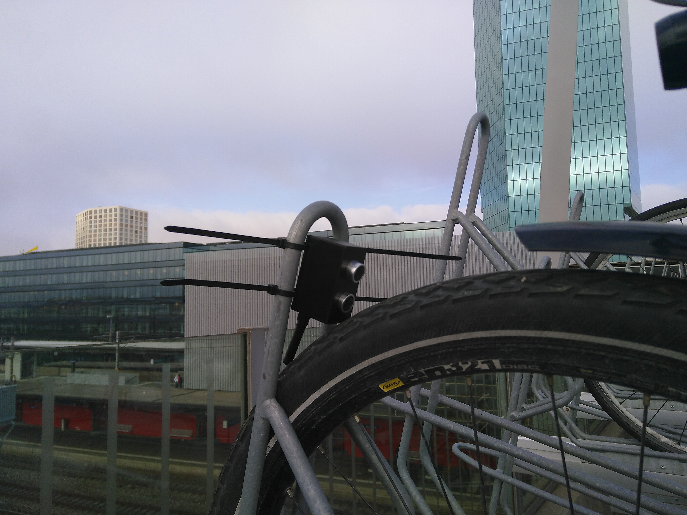

<!-- TABLE OF CONTENTS -->
## Table of Contents

* [About the Project](#about-the-project)
  * [Built With](#built-with)
* [Getting Started](#getting-started)
  * [Prerequisites](#prerequisites)
  * [Installation](#installation)
* [License](#license)


<!-- ABOUT THE PROJECT -->
## About The Project

This is a small ultrasonic sensor created during [MakeZürich](https://www.makezurich.ch/) for the #BicycleParking challenge. The goal is to detect if a bicycle parking spot is occupied using an ultrasonic distance sensor.



### Built With
The built using [TTGO Lora32 board](https://docs.platformio.org/en/latest/boards/espressif32/ttgo-lora32-v1.html#) and a [HC-SR04 sensor](https://cdn.sparkfun.com/datasheets/Sensors/Proximity/HCSR04.pdf). [PlatformIO](https://platformio.org/) is us used to develop and flash the firmeware for the board and data is transmitted to [The Things Network](https://www.thethingsnetwork.org/)

<!-- GETTING STARTED -->
## Getting Started

### Prerequisites

* Install [PlatformIO](https://platformio.org/platformio-ide)
* Create a The Things Network (TTN) Account https://account.thethingsnetwork.org/

### Installation

1. Create a TTN Application
2. Register a device
3. Use ABP authentification method and replace the needed values in main.cpp
4. Create a decoder in TTN
```
function Decoder(bytes, port) {
  var decoded = {};
  decoded.occupied = !!bytes[0]
  decoded.distance = bytes[1]
  decoded.rack = bytes[2];
  return decoded;
}
```
5. Connect the HC-SR04 sensor to the TTGO board 5V-VCC,GND-GND,23-TRIG,19-ECHO
6. Flash Firmeware

<!-- LICENSE -->
## License

Distributed under the MIT License. See `LICENSE` for more information.